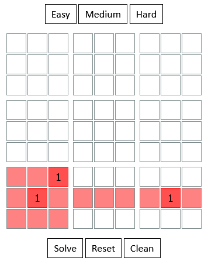

# Sudoku solver
Disclaimer: this is one of the first projects I ever wrote, way back in 2017 or so.

Simple js sudoku solver that also generates sudoku puzzles (3 difficulties - easy, medium, hard).

Solver also highlights incorrect moves:

